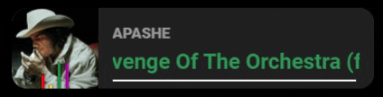

# NowPlayingWidget

This is an overlay for OBS displaying the media currently playing on Windows.

# Using this widget
Add a new browser source in your scene then change these properties : 

	- URL: http://localhost:61001 
	- width: 300
	- height: 90

Note: you can change listening URL and port by editing the appsettings.json file.
